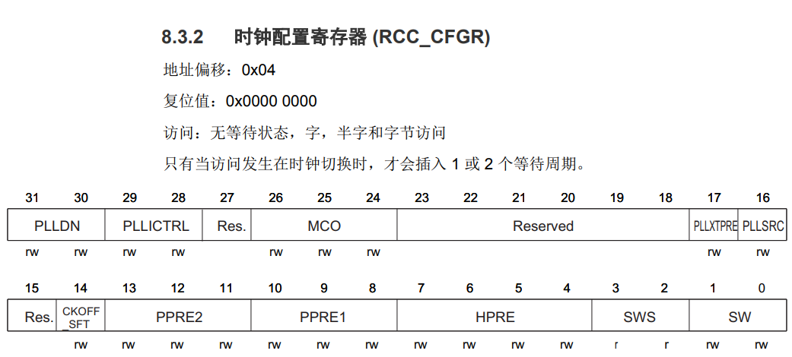

# RCC、系统时钟树和外设

## 时钟树

## RCC寄存器

### 总览

| 偏移量 | 名称 | 描述|
| :----: | :--: | :------------------------------------------ |
|0x0|[CR](#时钟控制寄存器rcc_cr)|时钟控制|
|0x4|[CFG](#时钟配置寄存器rcc_cfg)|时钟配置|
|0x8|[CIR](#时钟中断寄存器rcc_cir)|时钟中断|
|0xc|[APB2rst](#apb2外设复位寄存器rcc_apb2rst)|APB2 外设复位|
|0x10|[APB1rst](#apb1外设复位寄存器rcc_apb1rst)|APB1 外设复位|
|0x14|[AHB_EN](#ahb外设时钟使育寄存器rcc_ahb_en)|AHB 外设时钟使能|
|0x18|[APB2EN](#apb2外设时钟使能寄存器rcc_apb2en)|APB2 外设时钟使能|
|0x1c|[APB1EN](#apb1外设时钟使能寄存器rcc_apb1en)|APB1 外设时钟使能|
|0x20|[BDC](#备份域控制寄存器器rcc_bdc)|备份域控制|
|0x24|[CSR](#控制状态寄存器寄存器rcc_cs)|控制状态|
|0x28|[AHB_RST](#ahb外设复位寄存器rcc_ahbrst)|AHB 外设复位|
|0x2c-0x3c||无作用，保留|
|0x40|[SYS_CFG](#系统配置寄存器rcc_sys_cfg)|系统配置|
|0x44|HSI_DLY|HSI 延迟|
|0x48|HSE_DLY|HSE 延迟|

### 寄存器描述

#### 时钟控制寄存器(RCC_CR)

地址偏移：0x00
复位值：0x0000 XX03

高16位

<table>
    <tr>
        <th>31</th><th>30</th><th>29</th><th>28</th><th>27</th><th>26</th><th>25</th><th>24</th><th>23</th><th>22</th><th>21</th><th>20</th><th>19</th><th>18</th><th>17</th><th>16</th>
    </tr>
    <tr align="center">
        <td colspan="6">PLL_MUL</td><td>PLL_RDY</td><td>PLL_ON</td><td>Res.</td><td colspan="3">PLL_DIV</td><td>CSS_ON</td><td>HSE_BYP</td><td>HSE_RDY</td><td>HSE_ON</td>
    </tr>
    <tr align="center">
        <td>rw</td><td>rw</td><td>rw</td><td>rw</td><td>rw</td><td>rw</td>
        <td>r</td><td>rw</td><td></td><td>rw</td><td>rw</td><td>rw</td><td>rw</td><td>rw</td><td>r</td><td>rw</td>
    </tr>
</table>

|位|名称|读写|0/最小值|1/最大值|描述|
|-|:-:|:-:|:-:|:-:|-|
|26:31|PLL_MUL|读&写|0|0x3f(63)|PLL倍频系数|
|25|PLL_RDY|只读|PLL 未锁定|PLL 锁定|PLL 时钟就绪标志,PLL 锁定后由硬件置‘1’。|
|24|PLL_ON|读&写|禁止PLL|使能PLL||
|20:22|PLL_DIV|读&写|0|7|PLL分频系数|
|19|CSS_ON||时钟监测器关闭|开启(HSE就绪)|时钟安全系统使能|
|18|HSE_BYP||没有旁路|被旁路|外部高速时钟旁路|
|17|HSE_RDY||外部时钟没有就绪|外部时钟就绪|外部高速时钟就绪标志|
|16|HSE_ON||振荡器关闭|振荡器使能|外部高速时钟使能|

低16位

<table>
    <tr>
        <th>15</th><th>14</th><th>13</th><th>12</th><th>11</th><th>10</th><th>9</th><th>8</th><th>7</th><th>6</th><th>5</th><th>4</th><th>3</th><th>2</th><th>1</th><th>0</th>
    </tr>
    <tr align="center">
        <td colspan="2">Res.</td><td colspan="6">HSI_CAL</td><td colspan="5">Res.</td><td>HSI_TEN</td><td>HSI_RDY</td><td>HSI_ON</td>
    </tr>
    <tr align="center">
        <td></td><td></td><td>r</td><td>r</td><td>r</td><td>r</td><td>r</td><td>r</td>
        <td></td><td></td><td></td><td></td><td></td>
        <td>rw</td><td>r</td><td>rw</td>
    </tr>
</table>

|位|名称|读写|0/最小值|1/最大值|描述|
|-|:-:|:-:|:-:|:-:|-|
|8:13|HSI_CAL|只读|||内部高速时钟校准|
|2|HSI_TEN|读&写|HSI不自动随温度校准|HSI自动随温度校准|内部高速时钟温度校准使能|
|1|HSI_RDY|只读|没有就绪|内部8MHz时钟就绪|内部高速时钟就绪标志|
|0|HSI_ON|读&写|内部 8MHz 时钟关闭|开启|内部高速时钟使能|

#### 时钟配置寄存器(RCC_CFG)

|位|名称|读写|0/最小值|1/最大值|描述|
|-|:-:|:-:|:-:|:-:|-|
|30:31|PLL_DN|读&写|||PLL系数扩展|
|28:29|PLL_I_Ctrl|读&写|||PLL电流控制|
|24:26|MCO|读&写|||时钟输出|
|17|PLL_XtPre|读&写|||PLL HSE分频|
|16|PLL_SRC|读&写|||PLL输入时钟源|
|14|CK_Offset|读&写|||STOP 模式下时钟关闭控制位|
|11:13|P_Pre2|读&写|||APB2 预分频|
|8:10|P_Pre1|读&写|||APB1 预分频|
|4:7|H_Pre|读&写|||AHB 预分频|
|2:3|SWS|读|||系统时钟切换状态|
|0:1|SW|读&写|||系统时钟切换|

#### 时钟中断寄存器(RCC_CIR)

<table>
<tr>
<td>31</td>30<td>29</td><td>28</td><td>27</td><td>26</td><td>25</td><td>24</td><td>23</td><td>22</td><td>21</td><td>20</td><td>19</td><td>18</td>
</tr>

<tr align="center">
<td colspan="8">res</td><td></td><td></td><td></td>
</tr>

<tr align="center">
<td></td><td></td><td></td><td></td>
</tr>
</table>

#### APB2外设复位寄存器(RCC_APB2RST)

#### APB1外设复位寄存器(RCC_APB1RST)

#### AHB外设时钟使育寄存器(RCC_AHB_EN)

#### APB2外设时钟使能寄存器(RCC_APB2EN)

#### APB1外设时钟使能寄存器(RCC_APB1EN)

#### 备份域控制寄存器器(RCC_BDC)

#### 控制状态寄存器寄存器(RCC_CS)

#### AHB外设复位寄存器(RCC_AHBRST)

#### 系统配置寄存器(RCC_SYS_CFG)

#### HSI延迟寄存器(RCC_HSIDLY)
