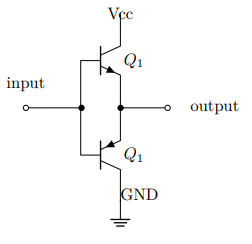

# GPIO

## GPIO硬件相关

### GPIO 的输出方式

有个外围电路去驱动负载

1. 推挽输出
    
2. 开漏输出
3. 如果 GPIO

### GPIO 的输入方式

1. 输入数字量
2. 输入模拟量

## GPIO 寄存器解读

### GPIO寄存器总览

| 偏移量 | 名称 | 描述                                        |
| :----: | :--: | :------------------------------------------ |
|  0x00  | CRL | 端口配置寄存器，对应GPIOx0-7的配置          |
|  0x04  | CRH | 端口配置寄存器，对应GPIOx8-15的配置         |
|  0x08  | IDR | 端口输入数据寄存器                          |
|  0x0C  | ODR | 端口输出数据寄存器                          |
|  0x10  | BSRR | 端口置位、清零寄存器                        |
|  0x14  | BRR | 端口清零寄存器                              |
|  0x18  | LCKR | 端口配置锁定寄存器                          |
|  0x1C  |  无  | 没有功能，保留                              |
|  0x20  | AFRL | 端口复用功能低位寄存器，对应GPIOx0-7的配置  |
|  0x24  | AFRH | 端口复用功能高位寄存器，对应GPIOx8-15的配置 |

### GPIO寄存器描述

1. CR L/H
2. IDR
3. ODR
4. BSRR
5. BRR
6. LCKR
7. AFR L/H

## HAL 库

Hardware Abstract Layer
硬件抽象层库

> **C 语言**
>
> [头文件书写](./c.md#头文件)
>
> ---

GPIO 初始化配置 CR 寄存器，有如下几种状态：

| CFG | MODE | 工作方式                                      | 名称 |
| --- | ---- | --------------------------------------------- | ---- |
| 00  | 00   | ``模拟输入 ``      |      |
| 00  | 01   | ``通用推挽输出 `` |      |
| 00  | 10   | 保留                                          |      |
| 00  | 11   | 保留                                          |      |
| 01  | 00   | ``浮空输入 ``      |      |
| 01  | 01   | ``通用开漏输出 `` |      |
| 01  | 10   | 保留                                          |      |
| 01  | 11   | 保留                                          |      |
| 10  | 00   | ``上下拉输入 ``    |      |
| 10  | 01   | ``复用推挽输出 `` |      |
| 10  | 10   | 保留                                          |      |
| 10  | 11   | 保留                                          |      |
| 11  | 00   | 保留                                          |      |
| 11  | 01   | ``复用开漏输出 `` |      |
| 11  | 10   | 保留                                          |      |
| 11  | 11   | 保留                                          |      |

# 按键

包装成函数
**回调函数**
